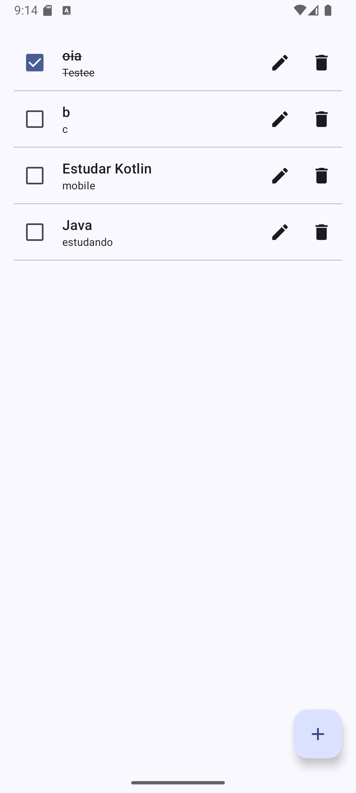
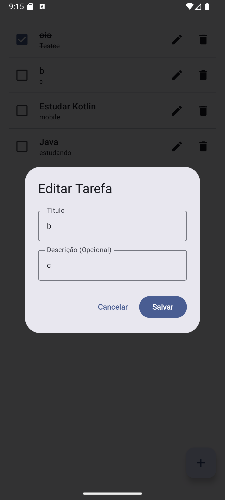

# FirebaseApp - Gerenciador de Tarefas

Este projeto consiste em um aplicativo Android de gerenciamento de tarefas, desenvolvido como atividade para a disciplina **Desenvolvimento para Dispositivos Móveis** na Universidade Federal do Ceará (UFC). A aplicação foi construída com **Jetpack Compose**, **Firebase Firestore** e **Dagger Hilt**, seguindo boas práticas de arquitetura MVVM.

## 📝 Funcionalidades

- Listagem de tarefas cadastradas
- Adição de novas tarefas (título e descrição)
- Edição de tarefas existentes
- Marcar/desmarcar tarefas como concluídas (persistência em Firebase)
- Exclusão de tarefas
- Tratamento de erros e logs com **Firebase Crashlytics**

## 🛠 Tecnologias e Bibliotecas

- **Kotlin**
- **Jetpack Compose** para UI declarativa
- **ViewModel** e **StateFlow** para gerenciamento de estado (MVVM)
- **Firebase Firestore** para persistência de dados
- **Firebase Crashlytics** para monitoramento de falhas
- **Dagger Hilt** para injeção de dependências
- **Coroutines** para chamadas assíncronas

## 📁 Estrutura do Projeto

```
com.example.firebaseapp
├── data
│   ├── model
│   │   └── Task.kt
│   └── repository
│       └── TaskRepository.kt
├── di
│   └── AppModule.kt
├── ui
│   ├── theme
│   │   └── ... (arquivos de tema gerados)
│   ├── viewmodel
│   │   └── TaskViewModel.kt
│   └── screens
│       └── TaskScreen.kt
└── MainActivity.kt
```

## 🚀 Como Executar

1. Clone este repositório:
   ```bash
   git clone https://github.com/seu-usuario/firebaseapp.git
   cd firebaseapp
   ```
2. Configure seu projeto no [Firebase Console](https://console.firebase.google.com/), habilite Firestore e Crashlytics.
3. Adicione o arquivo `google-services.json` na pasta `/app/`.
4. Abra o projeto no Android Studio e sincronize o Gradle.
5. Execute o aplicativo em um dispositivo ou emulador Android.

## 📸 Capturas de Tela

### Tela Principal



### Editar Tarefa



## 🎓 Sobre a Disciplina

Esta atividade faz parte da disciplina de **Desenvolvimento para Dispositivos Móveis** (DDM) da UFC. O objetivo é aplicar conhecimentos de arquitetura Android moderna, desenvolvimento reativo com Compose e integração com serviços de backend em nuvem.

---

*Desenvolvido por [Seu Nome] como parte da turma de Desenvolvimento para Dispositivos Móveis na UFC.*

